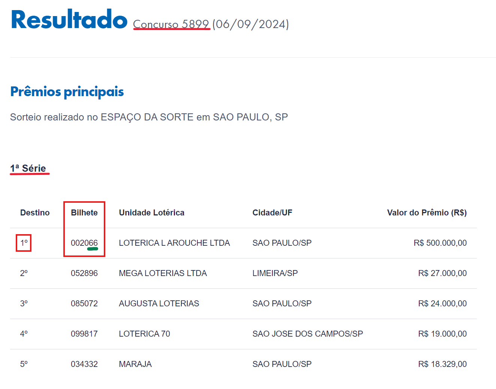
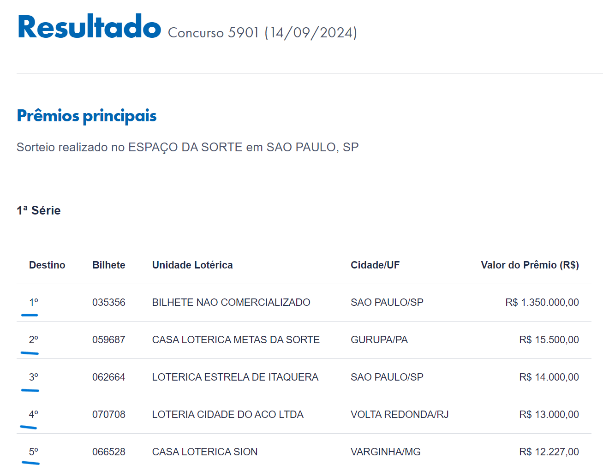

# Termos das rifas do PagodaoStore
Regulamentação das Rifas do PagodaoStore. [WhatsApp](https://chat.whatsapp.com/EZC5WnXSRsg8iP2WoGPnYi).

## 1. Quantidade de rifas correntes
As rifas serão identificadas por numeração de série e pelo ano (01/2024). Havendo apenas uma rifa por vez. A rifa perdurará até que seja finalizada (ou seja, todos os bilhetes vendidos), não havendo duas ou mais rifas concorrentes. Em caso de rifas extraordinárias poderão haver mais de uma rifa ocorrendo ao mesmo tempo.

## 2. Itens rifados
A princípio, serão sorteados apenas itens do Dota 2, que serão entregues via Solicitação de Troca na Steam pelos perfis:
- [Pagodao](https://steamcommunity.com/id/pagodaostore/)
- [AaronLeão](https://steamcommunity.com/id/aaronleao/)

Em caso de revogação da restrição, este termo sera atualizado e informado nos canais oficiais.

## 3. Venda dos bilhetes
O comprador deverá escolher os números desejados e efetuar o pagamento via **PIX: gg.pagodao@hotmail.com** e enviar os comprovantes para o perfil privado do admin do grupo do WhatsApp (**OPCIONAL:**  enviar o comprovante para rifas.pagodao@gmail.com). Após o recebimento e confirmação do pagamento os números escolhidos serão atualizados como indisponíveis para escolha durante a rifa corrente, e informado no grupo do WhatsApp.
 
## 4. Sorteio
As rifas do PagodaoStore serão contempladas pelo resultado dos Concursos da [Loteria Federal](https://loterias.caixa.gov.br/Paginas/Federal.aspx). A princípio serão **100** bilhetes vendidos por item, portanto os bilhetes terão numeração entre **00** à **99**.  A numeração do bilhete será escolhida de acordo os dois últimos dígitos da numerção Bilhete do 1º Destino da 1ª Série sorteado do Concurso vigente da Loteria Federal, conforme a imagem abaixo 

### 4.1 Rifas com múltiplos prêmios
As rifas poderão ter até 5 prêmios, que serão distribuídos de acordo com a sequencia dos bilhetes sorteados na coluna Destino do Concursos da [Loteria Federal](https://loterias.caixa.gov.br/Paginas/Federal.aspx), vide .

### 4.2 Concurso da Loteria Federal
Os Concursos da Loteria Federal ocorrem às Quartas-feiras e Sàbados, excepcionalmente em caso extraoficiais (e.g. feriádos). O concurso que será ultilizado como escolha do bilhete sorteado é o próximo Concurso da Loteria Federal subsequente a partir da data de finalização da venda das rifas.
Por exemplo: 
- Se a rifa **XX/YYYY** for finalizada até às **23:59h** da Terça-feira, o Concurso escolhido será o da próxima Quarta-feira (o mesmo vale para rifas finalizadas às Sextas-feiras).
- Se a rifa **XX/YYYY** for finalizada na Quarta-feira ou no Sábado, logo o Concurso escolhido será ou o do Sábado ou Quarta-feira respectivamente.

### 4.2 Cronograma dos Concursos da Loteria Federal
- [09/2024](https://www.caixa.gov.br/Downloads/caixa-loterias/Cronograma_09_setembro_2024.pdf)
- [10/2024](https://www.caixa.gov.br/Downloads/caixa-loterias/Cronograma_10_outubro_2024.pdf)
- [Futuras datas](https://loterias.caixa.gov.br/Paginas/Calendario-Sorteios.aspx)

## [Rifas passadas](rifas_realizadas.md)
